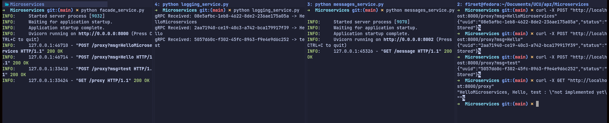

# Microservices Basic

## Requirements

- Python 3.11+ with pip

## Setup

1. Generate virtual environment and `source` it:

```bash
python -m venv .venv
source .venv/bin/activate
```

2. Install python requirements:

```bash
pip install -r requirements.txt
```

3. Generate supporting gRPC python files from `.proto`

```bash
python codegen.py
```

4. You're ready to go)

## Usage

Run all services in different terminals:

```bash
python facade_service.py
```

```bash
python logging_service.py
```

```bash
python message_service.py
```

<mark>| NOTE: |</mark> in terminals where services are run you need to source .venv/bin/activate

in $4^{th}$ terminal run:

```bash
curl -X POST "http://localhost:8000/proxy?msg=<Your message>" # send post message
```

```bash
curl -X GET "http://localhost:8000/proxy" # send get message
```

Example:
