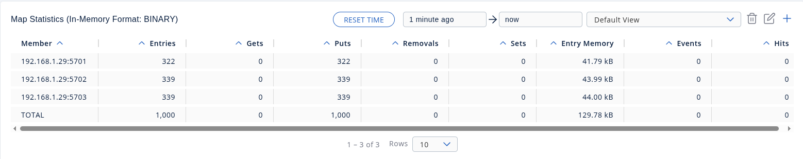
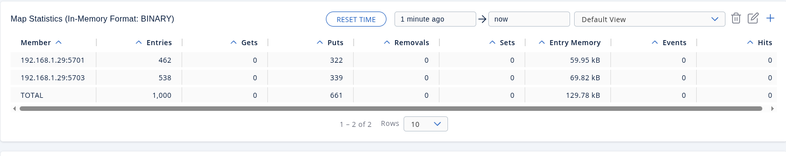
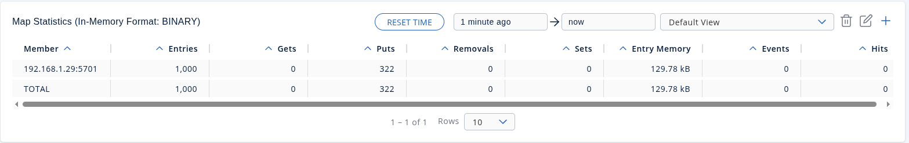
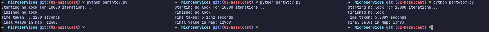
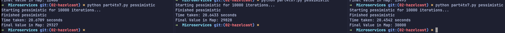
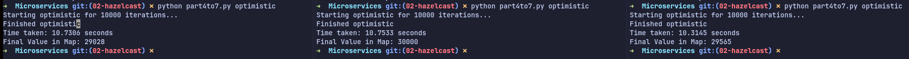

# *Task 2* Розгортання і робота з distributed in-memory data structures на основі Hazelcast: Distributed Map

## 1) Я не встановлював, а використав докер контейнер для запуску нод
## 2) Запуск нод:
```bash
docker run -e JAVA_OPTS="-Dhazelcast.local.publicAddress=127.0.0.1:5701" -p 5701:5701 hazelcast/hazelcast:5.3
docker run -e JAVA_OPTS="-Dhazelcast.local.publicAddress=127.0.0.1:5702" -p 5702:5701 hazelcast/hazelcast:5.3
docker run -e JAVA_OPTS="-Dhazelcast.local.publicAddress=127.0.0.1:5703" -p 5703:5701 hazelcast/hazelcast:5.3
```


> Кожен рядок в окремому терміналі для зручності і логів

## 3) [лінк на файл](/part3.py)

Інструкція щодо запуску:
1. `python -m venv .venv`
2. `pip install -r requirements.txt`
3. запуск файлу

Всі ноди:


-1 нода:


-2-га нода


Після перезапуску нод, вбив дві одночасно:


Щоб запобігти втраті даних, налаштуйте резервні копії (синхронні або асинхронні) в конфігурації кластера Hazelcast, щоб репліки даних існували на різних вузлах.

## 4,5,6,7) [file](/part4to7.py)
### Distributed Map without locks


30к не вийшло, вийшло менше 15к.
Приблизний середній час - 4.7 секунд роботи за 1000 ітерацій

### Distributed Map (песимістичне блокування)


Більше 20-ти секунд роботи проте рівно 30000 вкінці, жодних дата рейсів

### Distributed Map (оптимістичне блокування)


Часу майже вдвічі менше (10 c.) аніж в песимістичному, і жодного дата рейсу.

## 8) [file prod](/part8_prod.py) [file cons](/part8_cons.py)

1. Працює модель Round-Robin або "хто перший встиг": коли в черзі з'являється елемент, Hazelcast передає його тому клієнту, який на даний момент викликав метод `take()` і чекає на дані.
2. Якщо дойшло до ліміту черги, метод `queue.put()` у клієнта-producer заблокується