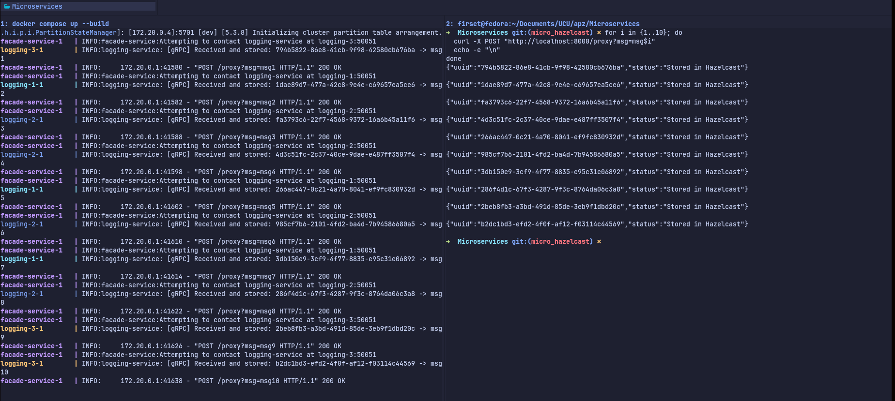
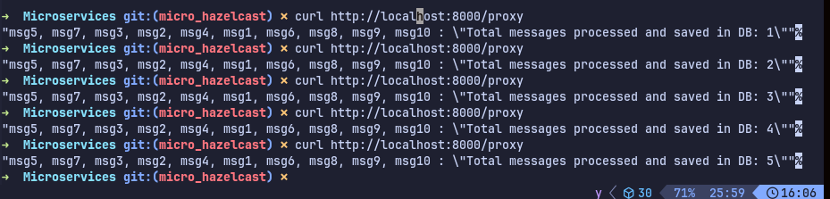
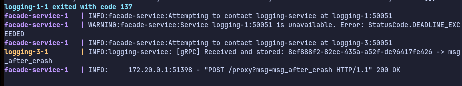
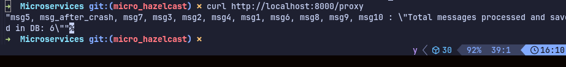
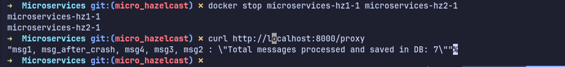
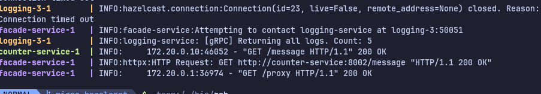

# Microservices

```
https://github.com/f1rset/Microservices
```
Inside repository just run:
```bash
docker compose up (-d for silent)
```

1. Services Running

2. Messages can be read

3. Kill one logging service


No data impact

4. Kill two hazelcast nodes (huge data loss because of no time to move data)

